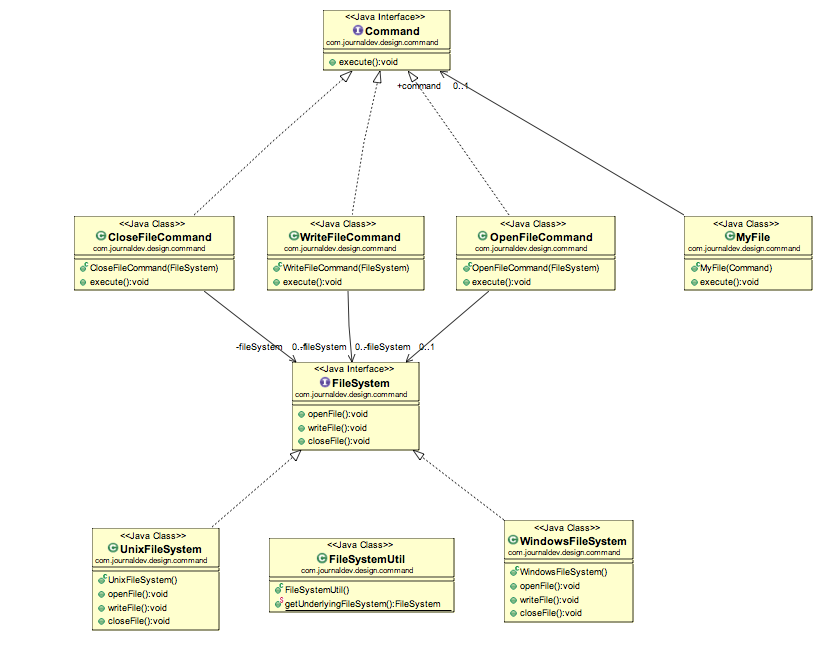

# Diagramme 

Voici le diagramme des classes que nous allons implémenter. Nous allons simuler un système de fichiers.
Le _FileSystem_ ici va jouer le rôle du _Client_, le fichier _MyFile_ joue ici le rôle _d'invoker_, les _ConcreteCommandes_ CloseFileCommande WriteFileCommand et OpenFileCommand vont éxécuter les méthodes nécessaires du _Receiver_ FileSystem.  
  

# Les _Receiver_

On crée nos objets _Receiver_ :

- L'interface _FileSystem_ :
```java

public interface FileSystemReceiver {

	void openFile();
	void writeFile();
	void closeFile();
}
```

- Un objet _UnixFileSystemReceiver_ qui implémentera l'interface _FileSystem_ : 
```java

public class UnixFileSystemReceiver implements FileSystemReceiver {

	public void openFile() {
		System.out.println("Opening file in unix OS");
	}

	public void writeFile() {
		System.out.println("Writing file in unix OS");
	}

	public void closeFile() {
		System.out.println("Closing file in unix OS");
	}

}
```

- Un objet _WindowsFileSystemReceiver_ qui implémentera l'interface _FileSystem_ : 
```java

public class WindowsFileSystemReceiver implements FileSystemReceiver {

	public void openFile() {
		System.out.println("Opening file in Windows OS");
		
	}

	public void writeFile() {
		System.out.println("Writing file in Windows OS");
	}

	public void closeFile() {
		System.out.println("Closing file in Windows OS");
	}

}
```

# L'interface _Command_

On crée l'interface _Commande_ qui sera implémentée pour chaque nouvelle commande
```java
public interface Command {

	void execute();
}
```

# Les _ConcreteCommand_ de notre _FileSystem_

Commande permettant d'ouvrir un fichier :
```java
public class OpenFileCommand implements Command {

	private FileSystemReceiver fileSystem;
	
	public OpenFileCommand(FileSystemReceiver fs){
		this.fileSystem=fs;
	}
	
	public void execute() {
		//open command is forwarding request to openFile method
		this.fileSystem.openFile();
	}

}
```
Commande permettant de fermer un fichier : 
```java
public class CloseFileCommand implements Command {

	private FileSystemReceiver fileSystem;
	
	public CloseFileCommand(FileSystemReceiver fs){
		this.fileSystem=fs;
	}
	
	public void execute() {
		this.fileSystem.closeFile();
	}

}
```

Commande permettant d'écrire dans un fichier : 
```java
public class WriteFileCommand implements Command {

	private FileSystemReceiver fileSystem;
	
	public WriteFileCommand(FileSystemReceiver fs){
		this.fileSystem=fs;
	}
	
	public void execute() {
		this.fileSystem.writeFile();
	}

}
```
# création de l'_Invoker_

Création du _FileInvoker_ (_MyFile_ sur le diagramme): 
```java
public class FileInvoker {

	public Command command;
	
	public FileInvoker(Command c){
		this.command=c;
	}
	
	public void execute(){
		this.command.execute();
	}
}
```

L'encapsulation ici est respectée, on ignore de quoi les _Command_ sont faites.

Nous allons créer un _FileSystemReceiverUtil_ pour fournir un _FileSystemReceiver_ approprié
```java
public class FileSystemReceiverUtil {
	
	public static FileSystemReceiver getUnderlyingFileSystem(){
		 String osName = System.getProperty("os.name");
		 System.out.println("Underlying OS is:"+osName);
		 if(osName.contains("Windows")){
			 return new WindowsFileSystemReceiver();
		 }else{
			 return new UnixFileSystemReceiver();
		 }
	}
	
}
```

# Execution de notre programme

```java runnable
// Interface FileSystemReceiver { autofold 
public interface FileSystemReceiver {

	void openFile();
	void writeFile();
	void closeFile();
}
// }
// class UnixFileSystemReceiver implements FileSystemReceiver { autofold
public class UnixFileSystemReceiver implements FileSystemReceiver {

	public void openFile() {
		System.out.println("Opening file in unix OS");
	}

	public void writeFile() {
		System.out.println("Writing file in unix OS");
	}

	public void closeFile() {
		System.out.println("Closing file in unix OS");
	}

}
// }
// class WindowsFile implements FileSystemReceiver { autofold
public class WindowsFileSystemReceiver implements FileSystemReceiver {

	public void openFile() {
		System.out.println("Opening file in Windows OS");
		
	}

	public void writeFile() {
		System.out.println("Writing file in Windows OS");
	}

	public void closeFile() {
		System.out.println("Closing file in Windows OS");
	}

}
// }
// Interface Command { autofold
public interface Command {

	void execute();
}
// }
// class OpenFileCommand implements Command { autofold
public class OpenFileCommand implements Command {

	private FileSystemReceiver fileSystem;
	
	public OpenFileCommand(FileSystemReceiver fs){
		this.fileSystem=fs;
	}
	
	public void execute() {
		//open command is forwarding request to openFile method
		this.fileSystem.openFile();
	}

}
// }
// class CloseFileCommand implements Command { autofold
public class CloseFileCommand implements Command {

	private FileSystemReceiver fileSystem;
	
	public CloseFileCommand(FileSystemReceiver fs){
		this.fileSystem=fs;
	}
	
	public void execute() {
		this.fileSystem.closeFile();
	}

}
// }
// class WriteFileCommand implements Command { autofold
public class WriteFileCommand implements Command {

	private FileSystemReceiver fileSystem;
	
	public WriteFileCommand(FileSystemReceiver fs){
		this.fileSystem=fs;
	}
	@Override
	public void execute() {
		this.fileSystem.writeFile();
	}

}
// }
// class FileInvoker { autofold
public class FileInvoker {

	public Command command;
	
	public FileInvoker(Command c){
		this.command=c;
	}
	
	public void execute(){
		this.command.execute();
	}
}
// }
// class FileSystemReceiverUtil { autofold
public class FileSystemReceiverUtil {
	
	public static FileSystemReceiver getUnderlyingFileSystem(){
		 String osName = System.getProperty("os.name");
		 System.out.println("Underlying OS is:"+osName);
		 if(osName.contains("Windows")){
			 return new WindowsFileSystemReceiver();
		 }else{
			 return new UnixFileSystemReceiver();
		 }
	}
	
}
// }
public class FileSystemClient {

	public static void main(String[] args) {
		//Creating the receiver object
		FileSystemReceiver fs = FileSystemReceiverUtil.getUnderlyingFileSystem();
		
		//creating command and associating with receiver
		OpenFileCommand openFileCommand = new OpenFileCommand(fs);
		
		//Creating invoker and associating with Command
		FileInvoker file = new FileInvoker(openFileCommand);
		
		//perform action on invoker object
		file.execute();
		
		WriteFileCommand writeFileCommand = new WriteFileCommand(fs);
		file = new FileInvoker(writeFileCommand);
		file.execute();
		
		CloseFileCommand closeFileCommand = new CloseFileCommand(fs);
		file = new FileInvoker(closeFileCommand);
		file.execute();
	}

}

```
