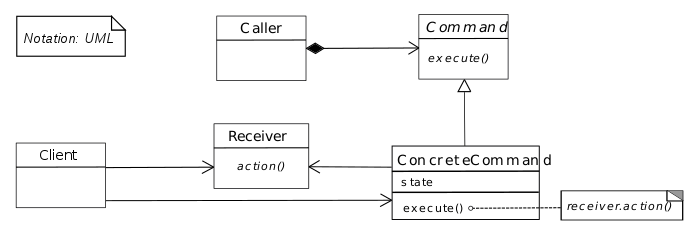

# Son objectif :

Lors d'une conception d'application on a souvent besoin d’émettre des requêtes sur n'importe quel objet, et ce, sans connaître, ni ses caractéristiques, ni ses fonctions/méthodes. C'est ici que le _Command Pattern_ va jouer son rôle, puisque il va l’encapsuler les requêtes.

_Petit rappel :_ l’encapsulation en langage orienté objet consiste à cacher l'implémentation de l'objet, en empêchant l'accès aux données par un autre moyen que les services proposés. L'encapsulation permet donc de garantir l'intégrité des données contenues dans l'objet. C'est l'un des principes les plus importants en _Java_ et langages similaires.

Ce pattern permet en premier lieu, d'apporter une sécurité dans les applications, grâce à cette fameuse encapsulation. Mais il permet aussi supprimer toutes duplications de code, au moyen d'une abstraction qui va lui permettre de fonctionner sans connaître l'objet cible ! Plus d'abstraction permet donc une meilleure maintenance du code, permettant de facilement le modifier ou l'étendre.

# L'implémentation du Command Pattern

  

Ce diagramme en notation _UML_  nous montre comment fonctionne notre pattern. Mais sans application concrète il peut être difficile de le comprendre. C'est pourquoi nous verrons comment il fonctionne et dans quel cadre il peut être utilisé !

Analysons ce diagramme du pattern :
-	Le Client va déclencher une requête, ici c'est ce qu'on apelle le rôle _d'invoker_ et ici c'est le _Caller_.
-	Cette requête à une commande qui lui est associée, dans noter diagramme c'est la _ConcreteCommande_ qui implémente l'interface _Commande_.
-	La _ConcreteCommande_ , grâce à la requête, va ensuite déclencher la méthode de l'objet associée, c'est le _Receiver_ de notre diagramme.

# Exemple d'une application du Command Pattern

Une personne veut aller ou éteindre son ordinateur :

**Avec le pattern command :**
La personne actionne _l’Invoker_ de son ordinateur, ici c'est un switch.  
La _ConcreteCommande_ « RestartCommand » ou « ShutDownCommand » est exécutée  
Cela permet ensuite d'invoquer les méthodes _shutDown()_ et _restart()_ du _Computer_ (_Receiver_). L'encapsulation permet de le faire fonctionner sur n'importe quel objet qui aurait une méthode restart() et shutDown().

**Sans pattern command :** 
La personne commande l'arrêt ou le démarrage de son ordinateur. Il va créer un objet Computer et apeller les méthodes restart() et shutDown().

Grâce à cet exemple, nous pouvons voir ici le rôle majeur du Command Pattern à savoir l'encapsulation. En l'appliquant, à note programme le client ne sait rien de se qui se passe. L’objet Computer, et méthodes qui lui sont appliquées pour l'éteindre ou l'allumer restent encapsulées !

